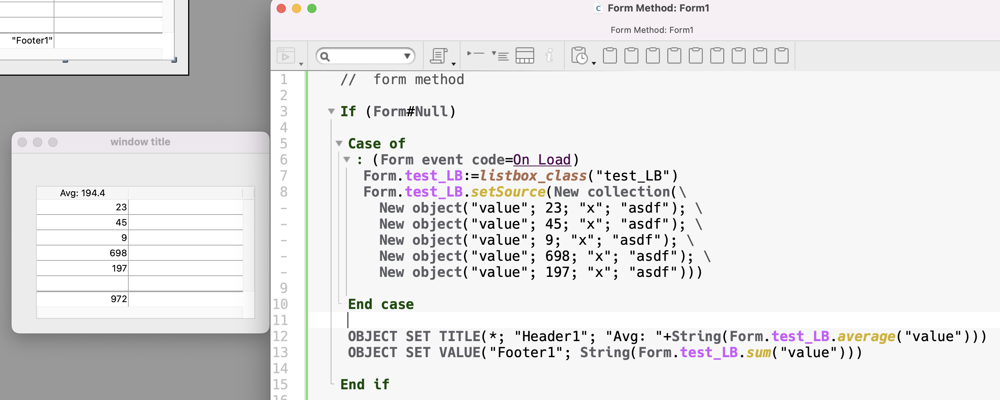

<!-- Type your summary here -->
## `listbox` class

To use simply instantiate the class with the name of the listbox object.

```4d
var $listbox : cs.listbox
$listbox:=listbox_class("test_LB")

ALERT("This listbox is named "+$lisbox.name)
```

Usually you will want to do this using **Form**.

### Setting up the listbox object

To work properly the listbox object, the widget on the form, must be configured as follows:


Note the class properties corresponding to key listbox object properties.

Also note this listbox is instantiated in **Form**. Commonly you do this during the `On load` event of the form:

```4d
//  form method

If (Form#Null)

	Case of
		: (Form event code=On Load)
			Form.test_LB:=listbox_class("test_LB")

	End case

End if
```

You can see here how the consistent naming of the form object is carried into the listbox data sources. This makes it easy to work with multiple listboxes on a single form simply by knowing the name of the listbox object. Following this convention you can work with any number of listboxes on the same form using different class instances.

### Source and Data

The listbox is populated by putting data into `.source` but `.data` is displayed - why? This approach offers two benefits:

1) it’s a way to limit the scope of the data the user has access to.
2) it allows us to query on the data without having to reload from the server.

First, if you never need to manage scope or queries this is all totally transparent and stays out of the way.

When `.setSource()` runs it puts whatever data you pass into `.source` and then puts a reference to `.source` into `.data`. Because we are working with references this doesn’t significantly change the memory used, which is totally different than doing this same sort of thing with arrays. Let’s say we have a lot of data we want to work with - 100,000 records. Normally this is not something you’d put in a listbox anyway because it’s just too big. The user could start typing into a find widget and we can query on `.source` and put the results into `.data`. This is extremely fast and doesn’t cause network traffic to the server. 

Working with references any changes the user makes to `.data` are also reflected in `.source`.

## Class Properties

A class is essentially an object. 4D doesn’t support the conept of protected and static properties. However, functions and properties prefixed with an underscore are _hidden_ in that they don’t readily appear in suggestion lists. You are also free to add properties to the class.

| Property      | Description                                                  | Form Object                    |
| ------------- | ------------------------------------------------------------ | ------------------------------ |
| name          | The name of the listbox object                               | Object Name                    |
| source        | The contents - a collection or entity selection.             | --                             |
| data          | A reference to source.                                       | Collection or entity selection |
| kind          | kind of data: entity selection or collection                 | --                             |
| currentItem   | The currently selected object of the listbox. <br />Default = **null** | Current item                   |
| position      | The row number of the currently selected row.                | Current item position          |
| selectedItems | Collection or entity selection of selected item(s)           | Selected Items                 |

You will generally only read these properties. There are functions for setting them.


## Class functions

| Data Functions                                | Description                                                  |
| --------------------------------------------- | ------------------------------------------------------------ |
| **setSource**(collection or entity selection) | populates the listbox with data and sets `kind`              |
| **setData**()                                 | updates `data` with `source`, a refresh.                     |
| **redraw**()                                  | If the underlying data displayed is changed outside the listbox it’s sometimes necessary to just set it to itself to cause the listbox object to redraw. |
| **updateEntitySelection**()                   | If this is an entity selection this loops thorugh each record and calls **.reload(**) to update the entity for changes made elsewhere. |


| State Functions                        | Description                                                  |
| -------------------------------------- | ------------------------------------------------------------ |
| **getIsSelected**()-> Boolean          | Returns True if there is something selected.                 |
| **getIndex**() -> $index               | Returns the index of the selected item or -1. (position is the _row_ number. This is the collection index.) |
| **getItem**() -> Variant               | Returns the currently selected item. `currentItem` is an object. If you happen to have a scalar collection currentItem doesn’t work. |
| **indexOf**( $what)-> $index           | If the data is a collection $what is a value.<br />If the data is an entity selection $what is an entity.<br />The result is the index of that value/entity or -1. |
| **findRow**($property; $value) -> $row | Returns the **row** number of the first instance where `$property` = `$value`<br />Note this is not a query which would return the entity or object. |

The following functions are the only ones that act on the listbox object. These

| **Function**                           |                                                 |
| -------------------------------------- | ----------------------------------------------- |
| **findRow**($property; $value) -> $row | Used **findRow()** and selects the row if found |
| **deselect**                           | Deselects all rows                              |

These functions are basically wrappers for the native **4D** functions and are applied to specific columns. ‘Columns’ are a property of the entity or collection object in the listbox. For example, if I have a collection where each object looks like

```
{ "number": 123, "someText": "hello world"}
```

I can get the average of the `number` column with

```
$avg:=Form.demo_LB.average("number")
```


| Function                                 | Description                                           |
| ---------------------------------------- | ----------------------------------------------------- |
| **sum**($key )->$value**:** **Real**     | Returns sum for specific `column`.                    |
| **min**($key )->$value**:** **Real**     |                                                       |
| **max**($key )->$value**:** **Real**     |                                                       |
| **average**($key )->$value**:** **Real** |                                                       |
| **extract**($key )->$collection          | Returns a collection of the values of the column      |
| **distinct**($key )->$collection         | Returns a collection of distinct values of the column |

**Another Example**



The listbox is instantiated into Form and populated with a collection.

The footer displays the sum of the values and the header displays the average.
