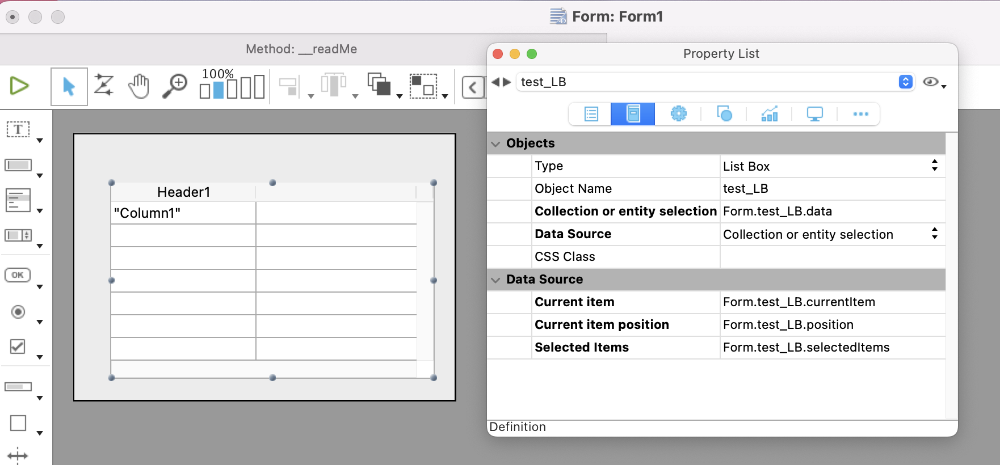
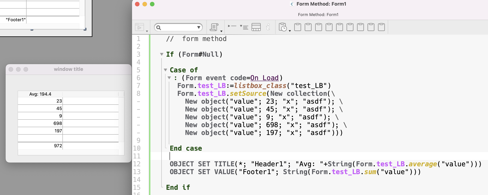

<!-- Type your summary here -->
## `listbox` class
### What does it do
This class is for managing the _data_ associated with a listbox form object. It's only useful for ORDA listboxes - working with collections or entity selections. It provides a robust means of working with listboxes, especially multiple listboxes, on a form. It has no dependencies. You can drop it into any project database from v18R6 forward and it will work making complex or simply listboxes easy to maintain.

The demo form provides some real world examples of use and my suggestions for best practices.

### Setting up the listbox object
To use simply instantiate the class with the name of the listbox object.

```4d
var $listbox : cs.listbox
$listbox:=listbox_class("test_LB")

ALERT("This listbox is named "+$lisbox.name)
```
Usually you will want to do this using **Form**.

To work properly the listbox object, the widget on the form, ***must*** be configured as follows:



Note the class properties corresponding to key listbox object properties. Fill them all in even if you don’t expect to ever need them. It’s not required but there’s really no reason not to. 

Note this listbox is instantiated in **Form**.

```4d
//  form method
var $test_LB : cs.listbox

$test_LB:=(Form.test_LB=null) ? cs.listbox.new("test_LB") : Form.test_LB

Case of
	: (Form event code=On Load)
		Form.test_LB:= $test_LB
		$test_LB.setSource(Form.entitySelection)  //  you must set some data - but it doesn't to be now

	: (Form event.objectName = "test_LB")
		Case of
			:(Form event code = On clicked)
			
			:(Form event code = On selection change)
			
			:(Form event code = On dataChange)
				$test_LB.currentItem.save()
		End case
	
End case

// enable / disable a button for deleting items from this listbox
OBJECT SET ENABLED(*; "btn_deleteRow"; $test_LB.isSelected)
// update a text variable showing the displayed state of the listbox
SET OBJECT VALUE("test_LB_state"; $test_LB.get_shortDesc()) // e.g. "12 selected out of 300 "

```

You can see here how the consistent naming of the form object is carried into the listbox data sources. This makes it easy to work with multiple listboxes on a single form simply by knowing the name of the listbox object. Following this convention you can work with any number of listboxes on the same form using different class instances.

I strongly recommend declaring a local variable typed for the class for the following reasons:

- you benefit from all the type-ahead features of 4D
- it’s usually a better variable name
- it’s easier to write code you can use in other forms as well

You can use this same pattern on lots of other objects as well. Notice the things you can do in a single line with totally readable names.

### Source and Data

The listbox is populated by putting data into `.source` but `.data` is displayed - why? This approach offers two benefits:

1) it’s a way to limit the scope of the data the user has access to
2) it allows us to query on the data without having to reload from the server
3) it simplifies queries that are focused on reducing the line displayed 

If you never need to manage scope or queries this is all totally transparent and stays out of the way.

When `.setSource()` runs it puts whatever data you pass into `.source` and then puts a reference to `.source` into `.data`. Because we are working with references this doesn’t significantly change the memory used, which is totally different than doing this same sort of thing with arrays. Let’s say we have a lot of data we want to work with - 100,000 records. Normally this is not something you’d put in a listbox anyway because it’s just too big. The user could start typing into a find widget and we can query on `.source` and put the results into `.data`. This is extremely fast and doesn’t cause network traffic to the server. 

Because we are working with references any changes the user makes to `.data` are also reflected in `.source`.

## Class Properties

These are the properties of the `listbox` class.

| Property      | Description                                                  | Form Object                    |
| ------------- | ------------------------------------------------------------ | ------------------------------ |
| name          | The name of the listbox object                               | Object Name                    |
| source        | The contents - a collection or entity selection.             | --                             |
| data          | A reference to source.                                       | Collection or entity selection |
| kind          | kind of data: entity selection or collection                 | --                             |
| currentItem   | The currently selected object of the listbox. <br />Default = **null** | Current item                   |
| position      | The row number of the currently selected row.                | Current item position          |
| selectedItems | Collection or entity selection of selected item(s)           | Selected Items                 |

You will generally only read these properties - there are functions for setting the ones relevant to working with the listbox. 

There are also several computed attributes which appear as properties but the are **read-only**. 

| Property          | Type    | Description                                                  |
| ----------------- | ------- | ------------------------------------------------------------ |
| dataLength        | integer | The number of rows in the data                               |
| isSelected        | boolean | True when there is at least 1 row selected. <br />This is equivalent to listbox.currentItem#Null |
| isCollection      | boolean | True is the `data` is a collection                           |
| isEntitySelection | boolean | True if the `data` is an entity selection                    |
| index             | integer | The index of the currentItem<br />This is equivalent to listbox.position - |

`isSelected` is probably the most useful of these properties because it allows you to easily tell if anything is selected. Very helpful for managing enabling/disabling buttons that depend on a selection in the listbox. 


## Class functions

| Data Functions                                               | Description                                                  |
| ------------------------------------------------------------ | ------------------------------------------------------------ |
| **setSource**(collection or entity selection)                | populates the listbox with data and sets `kind`.             |
| **setData**()                                                | updates `data` with `source`, a refresh.                     |
| **insert**($index **:** **Integer**; $element **:** **Variant**) **:** **Object** | Attempts to insert an element into data. Only works with collections. |
| **get_item**() -> Variant                                    | Returns the currently selected item. <br />If you happen to have a scalar collection this returns the value of that item. <br />Otherwise it returns the object or entity currently selected. |
| **redraw**()                                                 | If the underlying data displayed is changed outside the listbox it’s sometimes necessary to just set it to itself to cause the listbox object to redraw. |
| **reset**()                                                  | Another way to call `setData()` and refresh the listbox.     |
| **updateEntitySelection**()                                  | If this is an entity selection this loops thorugh each record and calls **.reload(**) to update the entity for changes made elsewhere. |
| **findRow**($property; $value) -> $row                       | Returns the **row** number of the first instance where `$property` = `$value`<br />Note this is not a query which would return the entity or object. |

There are two functions that operate on the actual form object. They are really out of scope for the way this class works by having a dependency on the form objects. They do nothing when called outside of the form so in that case are harmless and go a long way to making this class the only class necessary for the large majority of listboxes.

| State Functions                                              | Description                                                  |
| ------------------------------------------------------------ | ------------------------------------------------------------ |
| **deselect**()                                               | Deselects all rows in the listbox and clears the currentItem, position and selectedItems. |
| **selectRow**($criteria **:** **Variant**{; $value **:** **Variant**}) | Will attempt to select the row you specify. You do this two ways:<br />$class.selectRow(<rowNumber>)  // selects the row number you specify<br />$class.selectRow(<criteria>; <value>)  // uses `findRow()` with the parameters you supply and selects the row found. |
|                                                              |                                                              |

The following functions are basically wrappers for the respective 4D functions. They operate on `$class.data`.

| Function                                                     | Description                                           |
| ------------------------------------------------------------ | ----------------------------------------------------- |
| **sum**($key )->$value**:** **Real**                         | Returns sum for specific `column`.                    |
| **min**($key )->$value**:** **Real**                         |                                                       |
| **max**($key )->$value**:** **Real**                         |                                                       |
| **average**($key )->$value**:** **Real**                     |                                                       |
| **extract**($key )->$collection                              | Returns a collection of the values of the column      |
| **distinct**($key )->$collection                             | Returns a collection of distinct values of the column |
| **lastIndexOf**($key **:** **Text**; $findValue **:** **Variant**) |                                                       |

**Another Example**



The listbox is instantiated into Form and populated with a collection.

The footer displays the sum of the values and the header displays the average.
